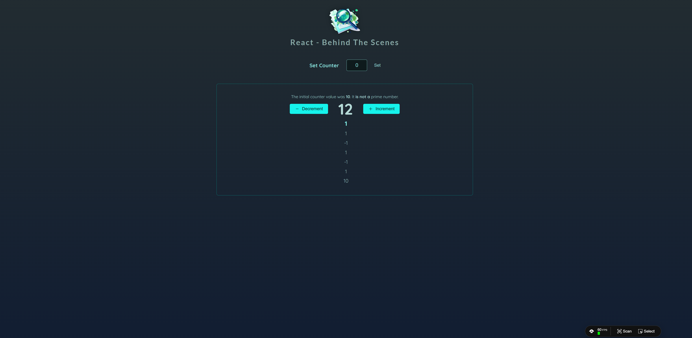

# React Behind the Scenes - 최적화 기술 학습 프로젝트



## 📖 프로젝트 개요

이 프로젝트는 React의 내부 동작 원리와 다양한 최적화 기법들을 실습하며 학습한 Counter 애플리케이션입니다.

## 🎯 학습 내용

- React의 렌더링 메커니즘 이해
- 컴포넌트 최적화 기법 학습
- MillionJS를 활용한 성능 최적화
- React Hooks 활용법
- 메모이제이션과 렌더링 최적화

## 🚀 주요 기능

### 1. 카운터 기능

- 숫자 증가/감소
- 초기값 설정
- 카운터 변경 히스토리 추적

### 2. 렌더링 로깅

- 컴포넌트 렌더링 추적
- 성능 분석을 위한 로그 시스템
- 렌더링 레벨별 색상 구분

### 3. 최적화 기법 적용

- `React.memo()` 활용
- `useCallback()` 콜백 메모이제이션
- `useMemo()` 값 메모이제이션
- 불필요한 리렌더링 방지

## 🛠️ 기술 스택

- **React 19.1.0** - 최신 React 버전
- **Vite** - 빠른 빌드 도구
- **MillionJS** - React 성능 최적화 라이브러리
- **ESLint** - 코드 품질 관리

## 📁 프로젝트 구조

```
src/
├── components/
│   ├── Counter/
│   │   ├── Counter.jsx           # 메인 카운터 컴포넌트
│   │   ├── ConfigureCounter.jsx  # 카운터 설정 컴포넌트
│   │   ├── CounterHistory.jsx    # 카운터 히스토리
│   │   └── CounterOutput.jsx     # 카운터 출력
│   ├── UI/
│   │   ├── IconButton.jsx        # 재사용 가능한 아이콘 버튼
│   │   └── Icons/               # SVG 아이콘 컴포넌트들
│   └── Header.jsx               # 헤더 컴포넌트
├── App.jsx                      # 메인 앱 컴포넌트
├── log.js                       # 렌더링 로깅 유틸리티
└── main.jsx                     # 앱 진입점
```

## 🎓 학습한 최적화 기법

### 1. React.memo()

```jsx
const Counter = memo(function Counter({ initialCount }) {
  // props가 변경되지 않으면 리렌더링 방지
});
```

### 2. useCallback()

```jsx
const handleDecrement = useCallback(function handleDecrement() {
  setCounterChanges((prev) => [
    { value: -1, id: Math.random() * 1000 },
    ...prev,
  ]);
}, []);
```

### 3. useMemo()

```jsx
const initialCountIsPrime = useMemo(
  () => isPrime(initialCount),
  [initialCount]
);
```

### 4. 컴포넌트 키 활용

```jsx
<Counter key={chosenCount} initialCount={chosenCount} />
```

### 5. MillionJS 린트

- Vite 설정에서 `@million/lint` 활용
- 성능 문제 감지 및 최적화 제안

## 📊 성능 모니터링

프로젝트는 렌더링 로깅 시스템을 포함하여 다음을 추적합니다:

- 컴포넌트 렌더링 횟수
- 렌더링 레벨 (중첩도)
- 함수 호출 추적 (예: 소수 계산)

개발자 도구 콘솔에서 색상별로 구분된 로그를 확인할 수 있습니다:

- 🔵 파란색: 컴포넌트 렌더링
- 🟣 보라색: 기타 함수 호출

## 🏃‍♂️ 시작하기

### 설치

```bash
npm install
```

### 개발 서버 실행

```bash
npm run dev
```

### 빌드

```bash
npm run build
```

### 린트 검사

```bash
npm run lint
```
